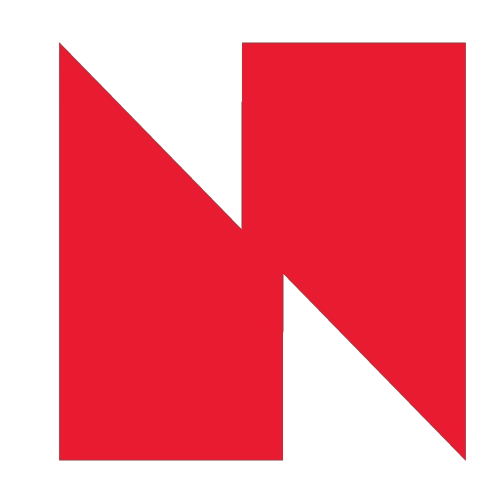

# NED Swiss - Digital Agency Website

<div align="center">
  
  
  [](https://nextjs.org/)
  [](https://reactjs.org/)
  [](https://www.typescriptlang.org/)
  [](https://tailwindcss.com/)
  [](https://next-intl-docs.vercel.app/)
  
  **Digital Excellence, Swiss Precision**
  
  A modern, multilingual digital agency website built with Next.js 15, featuring advanced animations, internationalization, and responsive design.
</div>

---

## 🌟 Features

### 🎨 **Modern Design & Animations**
- **GSAP Animations**: Smooth, professional animations throughout the site
- **Framer Motion**: Advanced component transitions and interactions
- **Lenis Smooth Scrolling**: Buttery-smooth scroll experience
- **Interactive Elements**: Hover effects, magnetic buttons, and micro-interactions
- **Responsive Design**: Mobile-first approach with Tailwind CSS

### 🌍 **Internationalization**
- **Multi-language Support**: English, German (Deutsch), and French (Français)
- **next-intl Integration**: Type-safe translations with automatic locale routing
- **SEO Optimized**: Localized metadata and structured data for each language
- **Dynamic Content**: All content dynamically translated based on user locale

### 🚀 **Performance & SEO**
- **Next.js 15 App Router**: Latest routing and rendering optimizations
- **Server Components**: Optimal performance with server-side rendering
- **Image Optimization**: Next.js Image component with Sharp processing
- **Structured Data**: Rich snippets for better search engine visibility
- **Sitemap Generation**: Automatic multilingual sitemap creation

### 📱 **Services Showcase**
- **Graphic Design & Printing**: Visual identity, branding, and print materials
- **Web Development**: Custom websites and web applications
- **Digital Marketing**: SEO, social media, and online advertising
- **Social Media Management**: Content creation and community management
- **Software Solutions**: Custom software development and integrations
- **Illuminated Signs**: LED systems and neon signage solutions

### 🎯 **Interactive Components**
- **Services Scroll Stack**: Animated service presentation
- **Project Portfolio**: Filterable gallery with case studies
- **Blog System**: Dynamic content management with markdown support
- **Contact Forms**: Multi-step forms with validation
- **WhatsApp Integration**: Direct customer communication
- **Visitor Tracking**: Analytics and user behavior insights

---

## 🛠️ Tech Stack

### **Frontend**
- **Framework**: Next.js 15.4.5 (App Router)
- **Language**: TypeScript 5.0
- **Styling**: Tailwind CSS 4.0
- **UI Components**: Radix UI, Headless UI
- **Animations**: GSAP 3.13.0, Framer Motion 12.23.12
- **Icons**: Lucide React, Tabler Icons, React Icons

### **Internationalization**
- **i18n**: next-intl 4.3.4
- **Supported Locales**: English (en), German (de), French (fr)
- **Translation Management**: JSON-based message files

### **Data & State Management**
- **State Management**: React Query (TanStack Query) 5.85.5
- **Form Handling**: React Hook Form 7.62.0 with Zod validation
- **Content Processing**: React Markdown with syntax highlighting

### **Development Tools**
- **Build Tool**: Turbopack (Next.js built-in)
- **Linting**: ESLint 9 with Next.js config
- **Type Checking**: TypeScript with strict configuration
- **Package Manager**: npm

---

## 📁 Project Structure

```
nedswiss/
├── app/                          # Next.js App Router
│   ├── [locale]/                # Internationalized routes
│   │   ├── about/              # About pages
│   │   ├── blogs/              # Blog system
│   │   ├── contact/            # Contact page
│   │   ├── services/           # Services pages
│   │   └── layout.tsx          # Locale-specific layout
│   ├── api/                    # API routes
│   │   ├── blogs/              # Blog API endpoints
│   │   ├── contact/            # Contact form handler
│   │   └── visitor-tracking/   # Analytics endpoints
│   └── globals.css             # Global styles
├── components/                  # React components
│   ├── about/                  # About page components
│   ├── blogs/                  # Blog-related components
│   ├── contact/                # Contact components
│   ├── home/                   # Homepage components
│   ├── layout/                 # Layout components
│   ├── navigation/             # Navigation components
│   ├── Services/               # Service components
│   └── ui/                     # Reusable UI components
├── comps/                      # Advanced components
│   ├── Animations/             # Animation components
│   ├── Backgrounds/            # Background effects
│   ├── Components/             # Complex components
│   └── TextAnimations/         # Text animation effects
├── i18n/                       # Internationalization
│   ├── en.json                # English translations
│   ├── de.json                # German translations
│   ├── fr.json                # French translations
│   └── request.ts             # i18n configuration
├── lib/                        # Utility libraries
│   ├── api/                   # API utilities
│   ├── hooks/                 # Custom React hooks
│   ├── seo/                   # SEO utilities
│   ├── types/                 # TypeScript definitions
│   └── utils/                 # General utilities
├── public/                     # Static assets
│   ├── clients/               # Client logos
│   ├── projects/              # Project images
│   └── ...                    # Other static files
└── data.tsx                   # Application data and content
```

---

## 🚀 Getting Started

### **Prerequisites**
- Node.js 18+ 
- npm or yarn package manager
- Git

### **Installation**

1. **Clone the repository**
   ```bash
   git clone https://github.com/Zahrannnn/nedswiss.git
   cd nedswiss
   ```

2. **Install dependencies**
   ```bash
   npm install
   ```

3. **Set up environment variables**
   ```bash
   # Create .env.local file
   cp .env.example .env.local
   
   # Add your environment variables
   NEXT_PUBLIC_API_URL=your_api_url
   CONTACT_EMAIL=your_contact_email
   ```

4. **Run the development server**
   ```bash
   npm run dev
   ```

5. **Open your browser**
   Navigate to [http://localhost:3000](http://localhost:3000)

### **Available Scripts**

```bash
# Development with Turbopack
npm run dev

# Production build with Turbopack
npm run build

# Start production server
npm run start

# Run ESLint
npm run lint
```

---

## 🌐 Internationalization

### **Supported Languages**
- **English (en)**: Default language
- **German (de)**: Deutsch - Swiss German market
- **French (fr)**: Français - Swiss French market

### **Adding New Languages**

1. **Add locale to configuration**
   ```typescript
   // i18n.ts
   export const locales = ['en', 'de', 'fr', 'your-locale'] as const;
   ```

2. **Create translation file**
   ```bash
   # Create new translation file
   touch i18n/your-locale.json
   ```

3. **Add translations**
   ```json
   {
     "Navigation": {
       "home": "Your translation",
       "about": "Your translation"
     }
   }
   ```

### **Translation Management**
- All translations are stored in JSON files under `i18n/`
- Use the `useTranslations` hook in client components
- Use `getTranslations` for server components and metadata

---

## 🎨 Styling & Animations

### **Tailwind CSS Configuration**
- Custom design system with NED Swiss brand colors
- Responsive breakpoints for all device sizes
- Custom utilities and components

### **Animation Libraries**
- **GSAP**: Complex animations and scroll-triggered effects
- **Framer Motion**: Component transitions and gestures
- **Lenis**: Smooth scrolling experience

### **Component Animations**
```typescript
// Example GSAP animation
gsap.fromTo('.animate-element', 
  { opacity: 0, y: 50 },
  { opacity: 1, y: 0, duration: 1, ease: 'power2.out' }
);
```

---

## 📊 SEO & Performance

### **SEO Features**
- Multilingual metadata generation
- Structured data for rich snippets
- Automatic sitemap generation
- Open Graph and Twitter Card meta tags
- Canonical URLs for each locale

### **Performance Optimizations**
- Next.js Image optimization with Sharp
- Server Components for faster initial loads
- Dynamic imports for code splitting
- Efficient caching strategies
- Optimized font loading

---

## 🚀 Deployment

### **Vercel (Recommended)**
1. **Connect repository to Vercel**
2. **Configure environment variables**
3. **Deploy automatically on push**

### **Custom Server**
```bash
# Build the application
npm run build

# Start the production server
npm run start
```

### **Docker Deployment**
```dockerfile
FROM node:18-alpine
WORKDIR /app
COPY package*.json ./
RUN npm ci --only=production
COPY . .
RUN npm run build
EXPOSE 3000
CMD ["npm", "start"]
```

---

## 🔧 Configuration

### **Next.js Configuration**
```typescript
// next.config.ts
const nextConfig = {
  images: {
    domains: ['images.unsplash.com', 'nedsite.runasp.net'],
  },
  eslint: {
    ignoreDuringBuilds: true,
  },
};
```

### **TypeScript Configuration**
- Strict mode enabled
- Path aliases configured
- Custom type definitions

---

## 📱 API Endpoints

### **Blog API**
- `GET /api/blogs` - Fetch all blog posts
- `GET /api/blogs/[id]` - Fetch specific blog post
- `GET /api/blogs/slug/[slug]` - Fetch blog by slug

### **Contact API**
- `POST /api/contact` - Handle contact form submissions

### **Utility APIs**
- `POST /api/revalidate` - Revalidate cached content
- `POST /api/visitor-tracking` - Track visitor analytics

---

## 🤝 Contributing

1. **Fork the repository**
2. **Create a feature branch**
   ```bash
   git checkout -b feature/amazing-feature
   ```
3. **Commit your changes**
   ```bash
   git commit -m 'Add amazing feature'
   ```
4. **Push to the branch**
   ```bash
   git push origin feature/amazing-feature
   ```
5. **Open a Pull Request**

---

## 📄 License

This project is proprietary software owned by NED Swiss. All rights reserved.

---

## 📞 Support & Contact

- **Website**: [ned-swiss.ch](https://ned-swiss.ch)
- **Email**: info@ned-swiss.ch
- **WhatsApp**: Available through website integration
- **LinkedIn**: [NED Swiss](https://linkedin.com/company/nedswiss)

---

## 🎯 Roadmap

- [ ] **Multi-tenant Support**: Support for multiple client portals
- [ ] **Advanced Analytics**: Enhanced visitor tracking and insights
- [ ] **CMS Integration**: Headless CMS for content management
- [ ] **E-commerce Integration**: Online service booking system
- [ ] **Mobile App**: React Native companion app
- [ ] **AI Integration**: Chatbot and automated customer support

---

<div align="center">
  <p><strong>Built with ❤️ by Zahran - Digital Excellence, Swiss Precision</strong></p>
  
  [](https://nextjs.org/)
  [](https://vercel.com/)
  [](https://www.typescriptlang.org/)
</div>